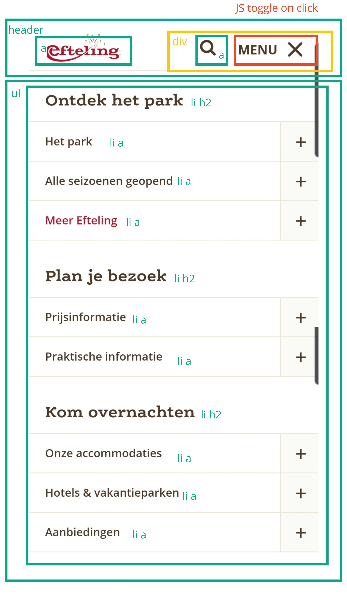

# Procesverslag
Markdown is een simpele manier om HTML te schrijven.  
Markdown cheat cheet: [Hulp bij het schrijven van Markdown](https://github.com/adam-p/markdown-here/wiki/Markdown-Cheatsheet).

Nb. De standaardstructuur en de spartaanse opmaak van de README.md zijn helemaal prima. Het gaat om de inhoud van je procesverslag. Besteedt de tijd voor pracht en praal aan je website.

Nb. Door *open* toe te voegen aan een *details* element kun je deze standaard open zetten. Fijn om dat steeds voor de relevante stuk(ken) te doen.

## Jij

  
uitwerken voor kick-off werkgroep

  ### Auteur:
  Lars de Vries

  #### Je startniveau:
  Rood

  #### Je focus:
  Responsive
 

## Je website

  
uitwerken voor kick-off werkgroep

  ### Je opdracht:
  Namaken van de Efteling website: https://www.efteling.com/nl

  #### Screenshot(s) van de eerste pagina (small screen): 
  Home pagina: https://www.efteling.com/nl

  

  #### Screenshot(s) van de tweede pagina (small screen):
  Herfst pagina: https://www.efteling.com/nl/park/seizoenen/herfst

  
 

## Toegankelijkheidstest 1/2 (week 1)

  
uitwerken na test in 1e werkgroep

  ### Bevindingen
  Lijst met je bevindingen die in de test naar voren kwamen:

  #### Concentratie (ballon)
  
  
  Wanneer je werd afgeleid door de ballon was het heel lastig om tegelijkertijd te focussen op de informatie die op je beeldscherm staat. Hierdoor vermijd je eigenlijk direct hele lappen tekst. Het helpt enorm dat er plaatjes op de website staan zodat je wel onthoudt waar je was gebleven en wat je op de huidige pagina kan vinden.

  Hier een omschrijving van hoe het opgelost kan worden (met indien nodig afbeeldingen)
  Het zou helpen om de knoppen groter te maken zodat deze direct je aandacht trekken. Verder is het belangrijk om geen lange stukken tekst te gebruiken op je site, wanneer dit niet anders kan is het denk ik van belang om grote duidelijke koppen toe te voegen. Hiernaast helpt het om goede afbeeldingen te gebruiken die de tekst ondersteunen.

  #### Screenreader
  Hier korte omschrijving (met indien nodig afbeeldingen)
  Er zijn verschillende paginas van de Efteling website getest met een screenreader. Wat voornamelijk opviel was dat je heel lang moet wachten, je kan niet snel door de pagina navigeren omdat je alles moet aanhoren. Verder hoor je bij elk element wat voor HTML tag dit element heeft.

  Hier een omschrijving van hoe het opgelost kan worden (met indien nodig afbeeldingen)
  Kritisch kijken naar welke content je wel en niet op de pagina wilt laten zien, overbodige informatie kan worden weggelaten. Verder is het ontzettend belangrijk om te letten op de juiste HTML tags zodat het duidelijk is wat wat is. Als laatste is het van belang om afbeeldingen een duidelijke 'alt' te geven zodat blinden/slechtzienden zich kunnen voortstellen wat er op de afbeeldingen te zien is.

  #### Muis en Toetsenbord 
  Hier korte omschrijving (met indien nodig afbeeldingen)
  De website is goed te besturen met behulp van alleen een toetsenbord. Het enige probleem waar tegenaan werd gelopen was dat je bij een nieuwe pagina steeds weer door de hele navigatie heen moet. De website heeft een hele uitgebreide navigatie met meerdere uitklapmenu's. Ik heb deze test slechts enkele minuten uitgevoerd maar werd in deze korte tijd al helemaal gek dat ik continu opnieuw door de navigatie moest gaan.

  Hier een omschrijving van hoe het opgelost kan worden (met indien nodig afbeeldingen)
  Het bovenstaande probleem zou kunnen worden opgelost door een knop toe te voegen met 'Skip to content'/'Ga naar de inhoud'. Door dit toe te voegen kunnen gebruikers de navigatie overslaan en scheelt dit een hoop tijd.

  #### Motoriek (shocks, elastiekjes)
  Hier korte omschrijving (met indien nodig afbeeldingen)
  Bevindingen elastiekjes: Wanneer je nog vinger vrij hebt dan is het nogsteeds gemakkelijk om door de website heen te navigeren. Pas wanneer je helemaal geen vingers meer kan gebruiken zorgt dit voor problemen. Wanneer dit het geval is kan je niet meer makkelijk op kleine knoppen klikken of klik je bijvoorbeeld op de verkeerde knop wanneer twee knoppen erg dicht tegen elkaar aan zitten.

  Hier een omschrijving van hoe het opgelost kan worden (met indien nodig afbeeldingen)
  Voor gebruikers met zo'n beperking is het daarom wenselijk dat de knoppen een groot formaat hebben en genoeg ruimte van elkaar verwijderd zijn zodat er niet perongeluk op een verkeerde knop wordt geklikt.

  #### Visueel (brillen, contrast, kleurenblind, dark/light)
  
  
  Hier korte omschrijving (met indien nodig afbeeldingen)
  Tijdens de toegankelijkheidstest zijn allereerst verschillende vormen van kleurenblindheid onderzocht. Bij al deze vormen was de content op de website goed te lezen. Dit had te maken met dat er door de hele website heen voldoende contrast werd gebruikt. Grote problemen kwamen naar voren bij het gebruik van de verschillende brillen (zwarte vlekken & wazig zicht), hierbij was het erg lastig om bijvoorbeeld je muis te volgen en om knoppen te vinden op het scherm. 
  
  Hier een omschrijving van hoe het opgelost kan worden (met indien nodig afbeeldingen)
  Primaire acties moeten heel duidelijk te herkennen zijn, dit kan worden gedaan door de knop extra groot te maken of door deze een opvallende kleur te geven.

## Breakdownschets (week 1)

  
uitwerken na afloop 2e werkgroep

  ### de hele pagina: 
  

  

  ### dynamisch deel (bijv menu): 
  

## Voortgang 1 (week 2)

  
uitwerken voor 1e voortgang

  ### Stand van zaken
  hier dit ging goed & dit was lastig (neem ook screenshots op van delen van je website en code)

  

  

  Ik merkte de afgelopen twee weken dat het schrijven van HTML en het opzetten van de layout in CSS best gemakkelijk ging. Verder merk ik wel dat heel veel kennis van vorig jaar is weggezakt waardoor ik best wat moeite heb met sommige dingen. Met name veel kleinere zaken zoals dingen positioneren, uitlijnen etc kosten me redelijk wat moeite en hebben soms ook al tot flinke frustraties geleid.
  
  Toch heb ik in een korte tijd ook al veel nieuwe dingen geleerd, onder andere grid had ik hiervoor nog niet eerder gebruikt. De huiswerkopdrachten die wij voor elke les dienen te maken helpen erg bij het toepassen van deze nieuwe technieken, door de powerpoints van deze opdrachten naast mijn werk te houden is het een stuk makkelijker om deze nieuwe dingen toe te passen.

  Verder merk ik wel dat mijn document beter moet organiseren om het overzichtelijk te houden voor mijzelf. Op dit moment heb ik alles onder elkaar geschreven zonder eigenlijk een duidelijke structuur aan te houden, hierdoor merk ik dat ik nu al vaak moet zoeken om bepaalde code terug te vinden.

  ### Agenda voor meeting
  samen met je groepje opstellen

  | student 1      | student 2          | student 3    | student 4        |
  | ---            | ---                | ---          | ---              |
  | dit bespreken  | en dit             | en ik dit    | en dan ik dat    |
  | en dat ook nog | dit als er tijd is | nog een punt | dit wil ik zeker |
  | ...            | ...                | ...          | ...              |

  - Problemen met GitHub -> wanneer ik mijn gehele map op GitHub wil zetten geeft het aan dat de bestanden te zwaar zijn om deze te kunnen uploaden -> hoe kan ik dit oplossen?
  - Vragen naar een handige manier om CSS document overzichtelijk te houden.
  - Op sommige buttons pakt de margin het tot de tekst van de button ipv de border van de button -> hoe zorg ik ervoor dat het tot de border gaat?

  ### Verslag van meeting
  hier na afloop snel de uitkomsten van de meeting vastleggen

  - Uitleg gekregen over hoe studentassistenten hun CSS document overzichtelijk houden -> bovenaan alle algemene dingen, vervolgens steeds specifieker. Overal duidelijke koppen maken zodat je code gemakkelijk terug kan vinden.
  - Problemen met webite op GitHub zetten -> studentassitent heeft hierbij geholpen.
  - Studentassistent heeft GitHub Desktop voor mij geinstalleerd en juist ingesteld -> hier zie ik alle aanpassingen die ik heb gemaakt, deze kan ik vervolgens op GitHub zetten door eerst op 'commit to main' en vervolgens op 'push' te klikken.

## Voortgang 2 (week 3)

  
uitwerken voor 2e voortgang

  ### Stand van zaken
  hier dit ging goed & dit was lastig (neem ook screenshots op van delen van je website en code)

  

  

  Deze week heb ik ontzettend veel werk verzet. Vorige week heb ik de belangrijkste opmaak van mijn paginas voor klein scherm gemaakt. Deze week heb ik mij vervolgens meer gericht op het responsive maken van de website. Op bovenstaande screenshots is te zien hoe mijn twee pagina's er momenteel uit zien op groot scherm.
  
  Om eerlijk te zijn ging het responsive maken van deze pagina's over het algemeen best wel goed ondanks dat ik eigenlijk nog nooit met media queries heb gewerkt. Sommige punten kostte wel veel tijd om het precies naar wens te krijgen. Een voorbeeld hiervan was de responsive navbar, zonder de powerpoints van de huiswerkopdrachten was dit waarschijnlijk een stuk moeilijker geweest. Door rustig de verschillende stappen te volgen is het uiteindelijk toch gelukt om dit voor elkaar te krijgen, het eindresultaat ben ik ook erg tevreden mee!
  
  Als ik kijk naar de hoeveelheid werk wat ik nog moet verrichten denk ik dat ik erg goed op schema lig. De pagina's zien er naar mijn mening al redelijk 'af' uit waardoor ik mij vanaf nu kan richten op het toevoegen van kleine dingen en het verbeteren van hetgeen wat ik tot nu toe heb gemaakt.

  ### Agenda voor meeting
  De meeting van het tweede voortgangsgesprek heb ik helaas moeten missen aangezien ik die dag ziek was. Ik heb dit voortgangsgesprek persoonlijk ingehaald met een studentenassistent op 27-09-2022. Voorafgaand aan dit gesprek wilde ik de volgende punten behandelen:

  - Wat is de juiste manier om footer responsive te maken? -> is het maken van 2 verschillende footers oke?
  - Wat is de beste manier om een simpel lijntje toe te voegen? -> hr / div gebruiken?
  - Buttons -> mag je hier classes voor gebruiken?

  ### Verslag van meeting
  Hieronder zijn de belangrijkste uitkomsten van het voortgangsgesprek op een rijtje gezet:

  - Omdat ik op klein scherm details en summary heb gebruikt binnen mijn footer is de beste manier om deze responsive te maken inderdaad door 2 verschillende footers te maken (klein scherm met details & summary, groot scherm zonder)
  - Lijntje toevoegen kan op meerdere manieren -> makkelijkste manier is om ::after te gebruiken.
  - Outline binnen een button toevoegen is nu ook met ::after gedaan -> dit zou je ook met een dubbele box-shadow kunnen doen (was achteraf misschien makkelijker geweest).
  - Je mag op buttons alleen classes gebruiken als je in je code laat zien dat je andere selectoren (zoals :nth-of-type) begrijpt en meerdere malen gebruikt.

## Toegankelijkheidstest 2/2 (week 4)

  
uitwerken na test in 8e werkgroep

  ### Bevindingen
  Lijst met je bevindingen die in de test naar voren kwamen (geef ook aan wat er verbeterd is):

  #### Screenreader
  Hier korte omschrijving (met indien nodig afbeeldingen)
  Het gebruiken van een screenreader op de pagina ging redelijk goed. Door overal juiste en semantische HTML te gebruiken is het logisch om door te pagina heen te gaan. Het enige minpunt waar ik tegenaan ben gelopen is dat de afbeeldingen soms lastig te begrijpen waren omdat de 'alt' beschrijving niet zo specifiek is. Ik kan mij voorstellen dat het voor blinden/slechtzienden daarom lastig te begrijpen is wat er exact op de afbeelding te zien is.

  Hier een omschrijving van hoe het opgelost kan worden (met indien nodig afbeeldingen)
  Het bovenstaande probleem kan gemakkelijk worden opgelost door goed te letten op het formuleren van een duidelijk 'alt'. Tijdens het coderen denk je hier vaak te snel over maar het is juist belangrijk om hier goed over na te denken zodat blinden/slechtzienden ondanks hun beperkingen de afbeeldingen kunnen begrijpen.

  #### Muis en Toetsenbord 
  Hier korte omschrijving (met indien nodig afbeeldingen)
  De website is goed te besturen met behulp van alleen een toetsenbord. Aan de website is nu een 'Ga naar content' knop toegevoegd die zichtbaar wordt wanneer je tabt, dit zorgt ervoor dat je gemakkelijk de navigatie kan overslaan zonder hier helemaal doorheen te moeten. Het enige grote probleem waar tegenaan werd gelopen is dat wanneer je op een klein scherm door de navigatie tabt zonder dat dit zichtbaar is op het scherm. Op dat moment is het dus niet duidelijk waar de focus op dat moment ligt. Verder is de focus state ook nog niet vormgegeven, deze heeft momenteel nog de standaard opmaak.

  Hier een omschrijving van hoe het opgelost kan worden (met indien nodig afbeeldingen)
  Het probleem van de navigatie kan worden opgelost door focus-whitin te gebruiken. Hiermee wordt de navigatie geopend wanneer hier focus op wordt gelegd.

  #### Motoriek (shocks, elastiekjes)
  Hier korte omschrijving (met indien nodig afbeeldingen)
  De buttons zijn groot genoeg om hier gemakkelijk op te kunnen klikken, ook is er voldoende ruimte tussen de verschillende buttons waardoor er niet perongeluk op een verkeerde knop wordt geklikt. Mogelijk staan de links in de footer wel iets te dicht onder elkaar.

  Hier een omschrijving van hoe het opgelost kan worden (met indien nodig afbeeldingen)
  Dit probleem kan simpel worden opgelost door de gap tussen de verschillende list items in de footer iets groter te maken. Op deze manier wordt er voorkomen dan gebruikers perongeluk op de verkeerde link klikken.

  #### Visueel (brillen, contrast, kleurenblind, dark/light). 
  Hier korte omschrijving (met indien nodig afbeeldingen)
  Opnieuw zijn verschillende vormen van kleurenblindheid onderzocht, bij al deze vormen was de content op de pagina goed zichtbaar. Overal op de verschillende paginas is namelijk voldoende contrast gebruikt. Het enige probleem waar tegenaan werd gelopen was bij het gebruik van de verschillende brillen (zwarte vlekken & wazig zicht), hierbij was het soms nogsteeds lastig om bepaalde knoppen te vinden op het scherm. De hover state van deze knoppen was wel vormgegeven maar dit is mogelijk te subtiel gedaan waardoor er te weinig onderscheid is tussen de verschillende states.

  Hier een omschrijving van hoe het opgelost kan worden (met indien nodig afbeeldingen)
  De hover state dient van de verschillende knoppen dient duidelijker te worden vormgegeven. Op dit moment wordt alleen de kleur iets donkerder, dit is mogelijk te weinig verschil. Dit probleem kan worden opgelost door het kleurverschil iets duidelijker te maken of door bijvoorbeeld de grootte van de knop aan te passen.

## Voortgang 3 (week 4)

  
uitwerken voor 3e voortgang

  ### Stand van zaken
  hier dit ging goed & dit was lastig (neem ook screenshots op van delen van je website en code)

  

  

  De afgelopen weken heb ik mij vooral gericht op het volledig responsive maken van de website, zo
  Ik had deze week nog wat meer dingen willen toevoegen aan de website, uiteindelijk ben ik hier niet echt aan toegekomen omdat ik het vrij druk had met andere vakken. Om deze reden heb ik gekozen om mij voornamelijk te richten op de kleinere details en op de accessability van de website. Zo heb ik onder andere de focus & hover states van alle buttons duidelijker gemaakt, een skip to content knop toegevoegd en het een stuk makkelijker gemaakt om door de website heen te tabben. Hierbij liep ik eerst wel aan tegen het tabben door een menu, dit zorgde eerst voor een hoop hoofdpijn maar uiteindelijk is dit toch gelukt en is de website goed te gebruiken met alleen een toetsenbord.
  
  heze week heb ik mij voornamelijk gericht op accessability 

  ### Agenda voor meeting
  Mijn groepje had deze week geen punten die zij wilden behandelen tijdens het laatste voortgangsgesprek. Om deze reden worden hieronder alleen de punten opgesomd die ik tijdens dit gesprek wilde bespreken met de studentassistenten:

  - Problemen met GitHub -> custom fonts laden hier niet juist in waardoor alleen de laatste fallback font wordt weergegeven -> hoe kan ik dit oplossen?
  - Afbeeldingen uit de readme laden ook niet juist in op GitHub -> hoe kan ik dit oplossen?
  - Ik heb twee headers gebruikt -> is dit juist of moet dit op een andere manier?
  - HTML/CSS code doorlopen op fouten.

  ### Verslag van meeting
  hier na afloop snel de uitkomsten van de meeting vastleggen

  - Problemen met GitHub zijn verholpen -> fonts worden nu ook via GitHub goed weergegeven.
  - grid repeat in plaats van dingen meerdere keren herhalen -> staat iets netter in de code
  - nagaan of elke div die ik heb gebruikt echt noodzakelijk is

  - DRIE KOLOMMEN -> div veranderen in article?

## Eindgesprek (week 5)

  
uitwerken voor eindgesprek

  ### Je uitkomst - karakteristiek screenshots:
  

  ### Dit ging goed/Heb ik geleerd: 
  Korte omschrijving met plaatjes
  Ik ben erg tevreden over hetgeen wat ik heb opgeleverd voor dit vak. Tijdens het hele proces heb ik ontzettend veel nieuwe dingen geleerd zoals grid, before & after, responsive navbar,  accesibillity en nog veel meer. Ook had ik in het begin moeite met het niet kunnen gebruiken van classes, vorig jaar gooide ik namenlijk echt overal een class op om deze elementen vervolgens in CSS te kunnen selecteren. Door verplicht andere selectoren te gebruiken werd ik in het begin vaak erg gefrustreerd, maar nu aan het einde van dit vak merk ik juist hoe ontzettend handig het is.

  

  ### Dit was lastig/Is niet gelukt:
  Korte omschrijving met plaatjes
  Om eerlijk te zijn is eigenlijk heel veel wat ik wilde maken uiteindelijk wel gelukt, sommige dingen natuurlijk wel met iets meer moeite dan de andere dingen. Bijvoorbeeld het volledig responsive maken van de website heeft op sommige punten veel tijd gekost maar uiteindelijk ben ik toch erg tevreden met het resultaat.
  Ik heb wel gekozen om sommige lastige dingen van de Efteling website niet na te maken omdat ik bang was hier teveel tijd aan kwijt te zijn.
  

## Bronnenlijst

  
continu bijhouden terwijl je werkt

  Nb. Wees specifiek ('css-tricks' als bron is bijv. niet specifiek genoeg).

  1. bron 1
  2. bron 2
  3. ...

